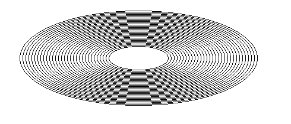
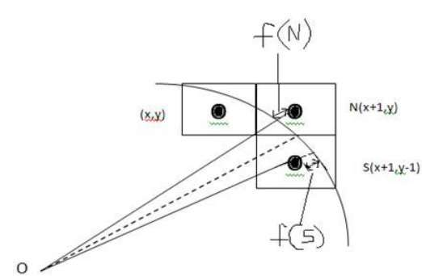
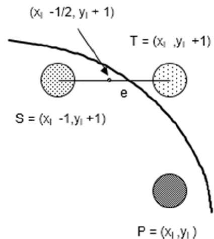

# Ellips and circle drawing algorithm

  

| List of ellips drawing algorithms | Stage |
| ------------- |:-------------:|
|Bresenham's algorithm|✅|
|Middle point algorithm|✅|
|Canonical equation of a circle|✅|
|Parametric equation of a circle|✅|

#### <i>Legend:</i>
<ul>
<li>✅ - ОК
<li>⚠️ - problem
<li>🆘 - need help
<li>♻️ - need update(see issues)
<li>🌀 - in process
</ul>

# Bresenham's algorithm
From the following illustration, you can see that we have put the pixel at (X, Y) location and now need to decide where to put the next pixel − at N (X+1, Y) or at S (X+1, Y-1).

  

This can be decided by the decision parameter d.

* If d <= 0, then N(X+1, Y) is to be chosen as next pixel.
* If d > 0, then S(X+1, Y-1) is to be chosen as the next pixel.

# Middle point algorithm

If PK < 0 then next point on circle (0,0) is (XK+1,YK) and
   * PK+1 = PK + 2XK+1 + 1
Else
   * PK+1 = PK + 2XK+1 + 1 – 2YK+1
	
Where, 2XK+1 = 2XK+2 and 2YK+1 = 2YK-2.

Repeat until X >= Y.

  

