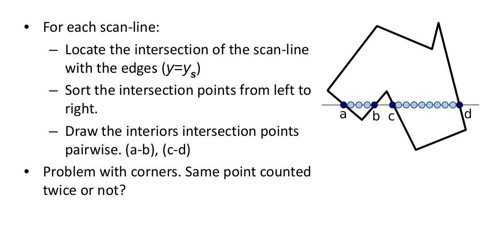
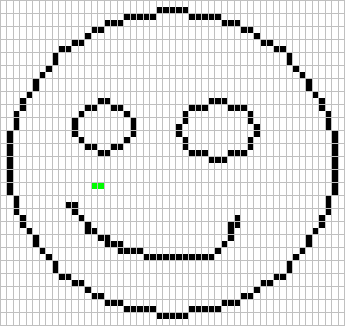

# Filling algorithm

| List of flood fill algorithms | Stage |
| ------------- |:-------------:|
|[Scanline]()|🌀|
|[Flood fill]()|🌀|
|[Scanline Flood fill](scanline-flood-fill/README.md)|✅|
|[XOR](xor/README.md)|✅|
|[XOR with partition]()|🌀|

#### <i>Legend:</i>
<ul>
<li>✅ - ОК
<li>⚠️ - problem
<li>🆘 - need help
<li>♻️ - need update(see issues)
<li>🌀 - in process
</ul>

# Scanline

  

  

# Flood fill

  

  

# Scanline Flood fill

  

  

# XOR

  

# XOR with partition

  

#### <i>Legend:</i>
<ul>
<li>✅ - ОК
<li>⚠️ - problem
<li>🆘 - need help
<li>♻️ - need update(see issues)
<li>🌀 - in process
</ul>
