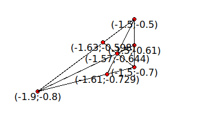

# Task

Find a triangle in which the difference between the minimum and the maximum number of points that fall into each of the six triangles formed by the intersection of bisectors is minimal.

Example for the file "input.txt"

  

