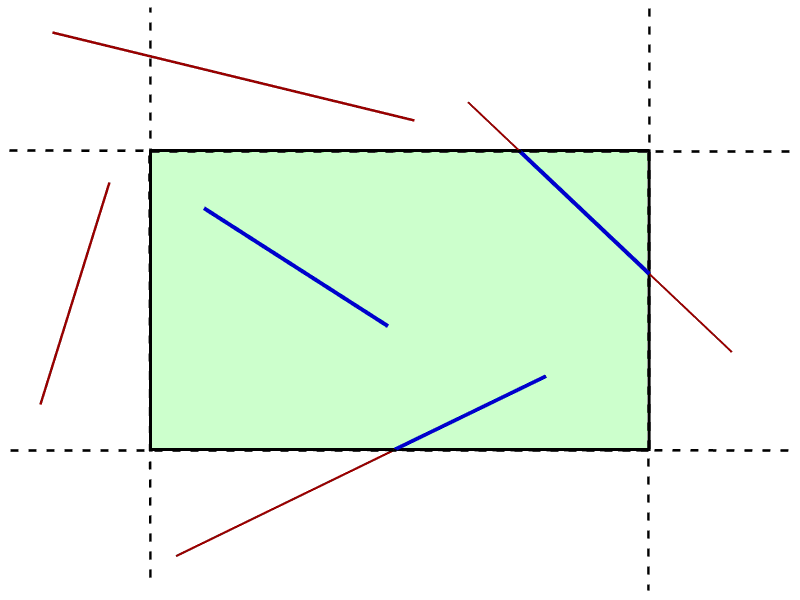
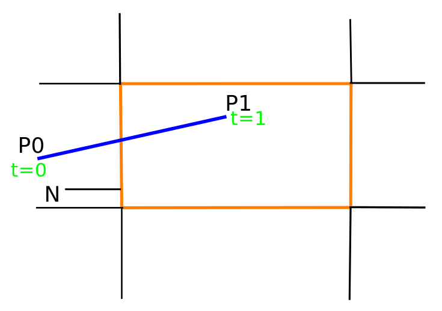
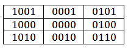

# Line clipping

  

| List of algorithms  |     Stage     |
| ------------- |:-------------:|
|[Fast clipping algorithm](Fast-clipping/)|✅|
|[Cyrus-Beck algorithm](Cyrus–Beck/)|✅|
|[Cohen-Sutherland algorithm](Cohen–Sutherland/)|✅|
|[Liang–Barsky algorithm]()|🌀|
|[Nicholl–Lee–Nicholl algorithm]()|🌀|
|[Mid point algorithm]()|🌀|
|[Sutherland–Hodgman algorithm]()|🌀|
|[Weiler–Atherton algorithm]()|🌀|

#### <i>Legend:</i>
<ul>
<li>✅ - ОК
<li>⚠️ - problem
<li>🆘 - need help
<li>♻️ - need update(see issues)
<li>🌀 - in process
</ul>

# Fast clipping algorithm

This algorithm has similarities with Cohen–Sutherland. The start and end positions are classified by which portion of the 9-area grid they occupy. A large switch statement jumps to a specialized handler for that case. In contrast, Cohen–Sutherland may have to iterate several times to handle the same case.

# Cyrus–Beck algorithm

  

Cyrus–Beck is a general algorithm and can be used with a convex polygon clipping window, unlike Sutherland–Cohen, which can be used only on a rectangular clipping area.

Here the parametric equation of a line in the view plane is

  

where `0` ≤ `t` ≤ `1`.

Now to find the intersection point with the clipping window, we calculate the value of the dot product. Let `P` be a point on the clipping plane `E`.

Calculate 

  

    if < 0, vector pointed towards interior;
    if = 0, vector pointed parallel to plane containing p;
    if > 0, vector pointed away from interior.

Here `n` stands for normal of the current clipping plane (pointed away from interior).

By this we select the point of intersection of line and clipping window where (dot product is 0) and hence clip the line.

# Cohen-Sutherland algorithm

The algorithm includes, excludes or partially includes the line based on whether:

  * Both endpoints are in the viewport region (bitwise OR of endpoints = 00): trivial accept.

  * Both endpoints share at least one non-visible region, which implies that the line does not cross the visible region. (bitwise AND of endpoints ≠ 0): trivial reject.

  * Both endpoints are in different regions: in case of this nontrivial situation the algorithm finds one of the two points that is outside the viewport region (there will be at least one point outside). The intersection of the outpoint and extended viewport border is then calculated (i.e. with the parametric equation for the line), and this new point replaces the outpoint. The algorithm repeats until a trivial accept or reject occurs.

The numbers in the figure below are called outcodes. An outcode is computed for each of the two points in the line. The outcode will have 4 bits for two-dimensional clipping, or 6 bits in the three-dimensional case. The first bit is set to 1 if the point is above the viewport. The bits in the 2D outcode represent: top, bottom, right, left. For example, the outcode 1010 represents a point that is top-right of the viewport.

  

