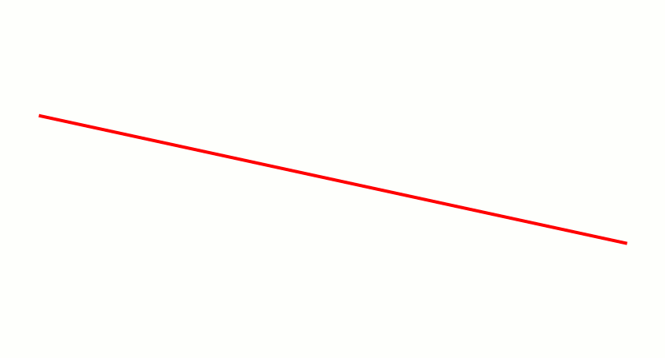

# Line drawing algorithm

  

A line drawing algorithm is a graphical algorithm for approximating a line segment on discrete graphical media. On discrete media, such as pixel-based displays and printers, line drawing requires such an approximation (in nontrivial cases). Basic algorithms rasterize lines in one color. A better representation with multiple color gradations requires an advanced process, spatial anti-aliasing.

| List of line drawing algorithms | Stage |
| ------------- |:-------------:|
|Digital differential analyzer|✅|
|Bresenham's line algorithm(float)|✅|
|Bresenham's line algorithm(int)|✅|
|Xiaolin Wu's line algorithm|✅|

#### <i>Legend:</i>
<ul>
<li>✅ - ОК
<li>⚠️ - problem
<li>🆘 - need help
<li>♻️ - need update(see issues)
<li>🌀 - in process
</ul>

# Digital differential analyzer and Bresenham 

  

# Xiaolin Wu's line algorithm

  

