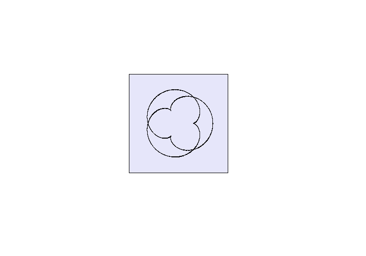
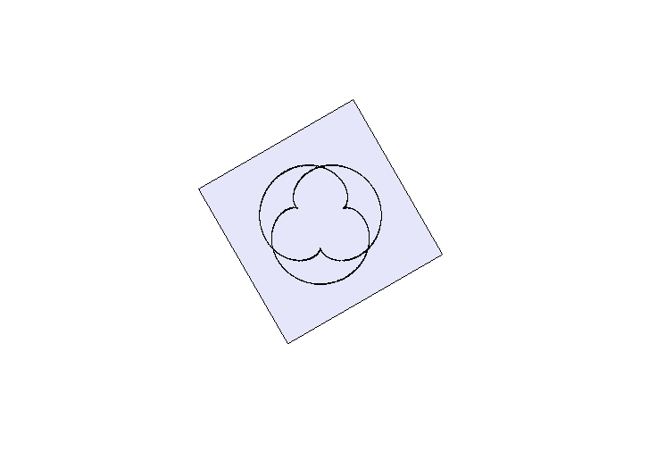
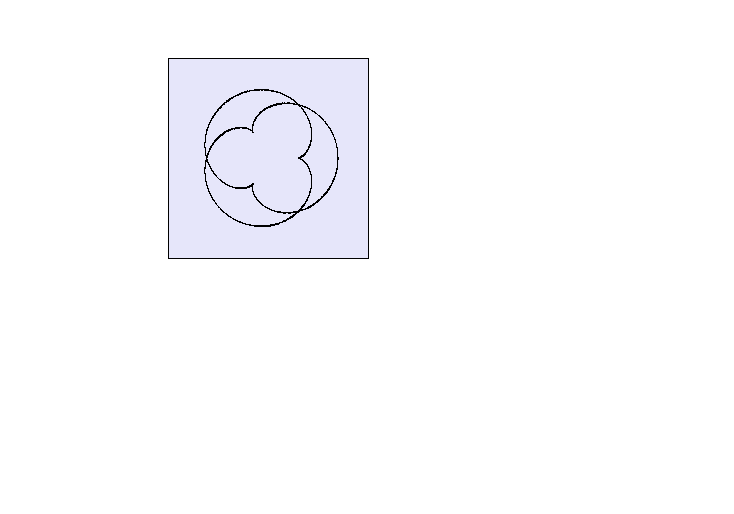
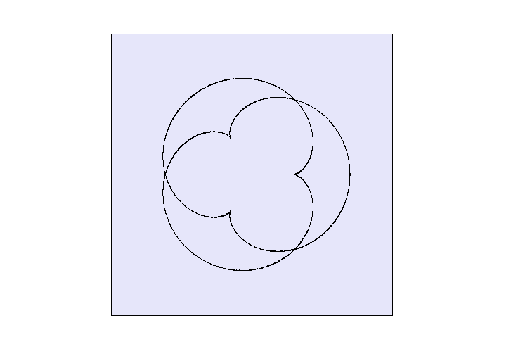

# Transformation of figures

In linear algebra, linear transformations can be represented by matrices. If `T` is a linear transformation mapping `R1` to `R2` and vector `x` is a column vector witn `n` entries, then

  

for some `m` x `n` matrix `A`, called the transformation matrix of `T`

Matrices allow arbitrary linear transformations to be displayed in a consistent format, suitable for computation. This also allows transformations to be concatenated easily (by multiplying their matrices).

  

# For example

  

# Rotate by 30 degrees

  

# Translation

  

# Scaling X2

  

